<p align="center">
  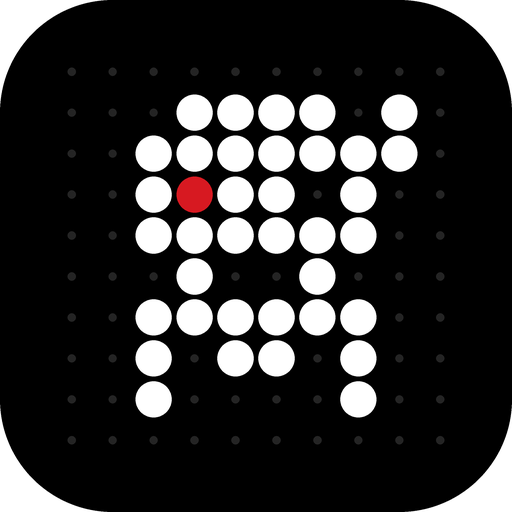
</p>

<h1 align="center">DotTab</h1>

<p align="center"><b>Open a tab. Own the day.</b><br>
A minimal, dot-matrix new tab for Chrome. 28 widgets on one grid. No account, no tracking.</p>

<p align="center">
  <a href="https://chromewebstore.google.com/search/DotTab">Add to Chrome</a> ·
  <a href="https://sanketshinde3001.github.io/dottab/guide.html">Guide</a> ·
  <a href="https://sanketshinde3001.github.io/dottab/privacy.html">Privacy</a> ·
  <a href="https://buymeacoffee.com/sanketshinde">Support</a>
</p>

<br>

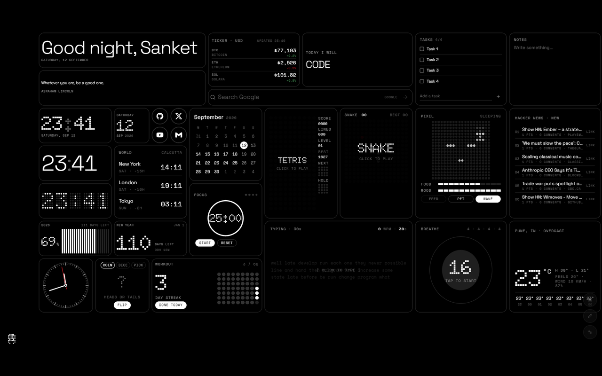

<br>

## Everything, one grid

|  |  |  |
|:--:|:--:|:--:|
| 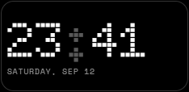 | 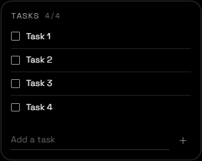 | 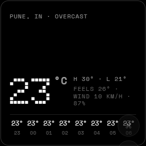 |
| 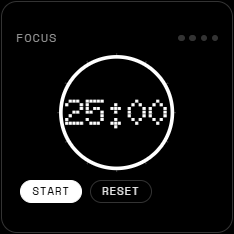 | 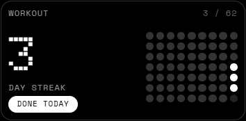 | 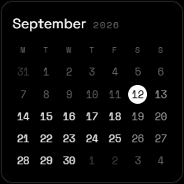 |
| 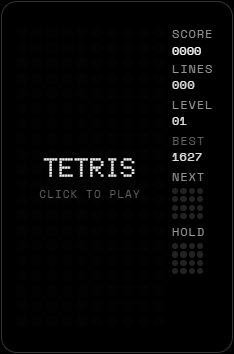 | 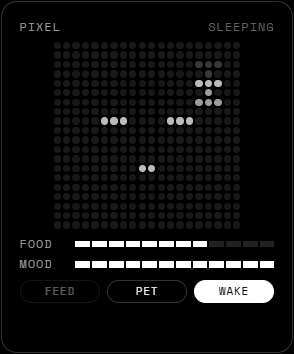 | 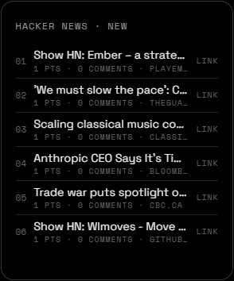 |

**Time** — Greeting · Clock · Minimal · Analog · LED · Date · Calendar · World Clock · Countdown · Progress
**Planning** — Tasks · Notes · Habit
**Focus** — Pomodoro · Breathe · Intention
**Info** — Search · Weather · Headlines · Ticker · Quote · Shortcuts · Top Sites
**Fun** — Snake · Tetris · Typing Test · Decide · Pixel Pet

<br>

## Three keys

```
E        edit the grid        ,        settings        Ctrl K   palette
```

Drag anywhere. Resize from the corner. Five presets, or share your layout as a code that fits in a tweet.

<br>

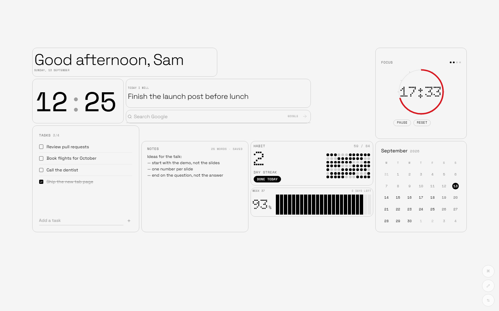

<br>

## Private by design

Your layout, notes and tasks live in Chrome's local storage. No analytics, no account, no remote code. Widgets that need live data call public APIs directly — nothing else leaves your browser. [Read the policy.](https://sanketshinde3001.github.io/dottab/privacy.html)

<br>

<p align="center"><sub>This repo is the website. Built by <a href="https://buymeacoffee.com/sanketshinde">Sanket Shinde</a>.</sub></p>
